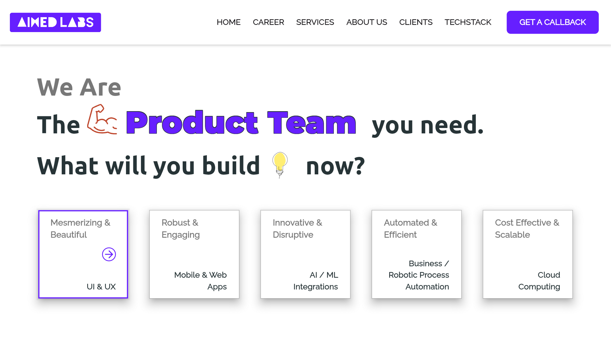
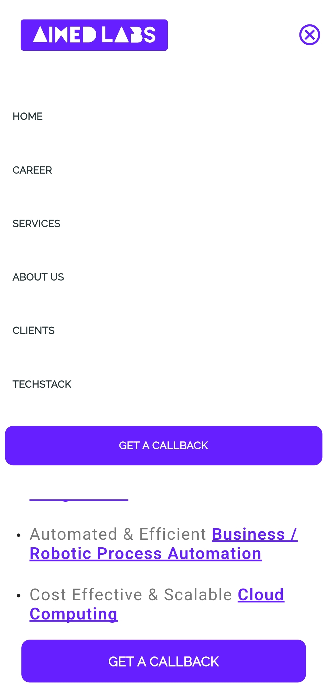
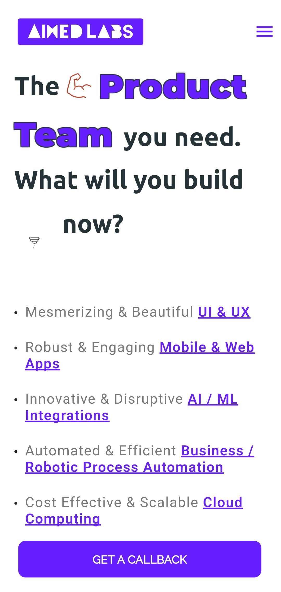

# Responsive Web App

A mini clone of https://aimedlabs.com





## Features

- **Responsive Design**: This Flutter web app is designed to work seamlessly on various screen sizes, from mobile devices to desktops.

## Getting Started

Follow these steps to get the project up and running:

1. **Clone the repository**:

    ```
    git clone https://github.com/vedasjad/responsive-task.git
    ```

2. **Navigate to the project directory**:

    ```
    cd responsive-task
    ```

3. **Install dependencies**:

    ```
    flutter pub get
    ```

4. **Run the app**:

    ```
    flutter run -d web
    ```

## Project Structure

- `lib/`: This is where most of the app's code resides.
    - `main.dart`: The main entry point for the web app.
    - `features/`: Contains different features of the app.
    - `common/`: Reusable UI components and colors.

- `assets/`: Store your static assets like images, animations and fonts here.

- `web/`: Configuration files for web deployment.

## Contributing

We welcome contributions to this Flutter web app template. If you find any issues, have suggestions, or want to add new features, please open an issue or create a pull request.

## Acknowledgments

- Thanks to the Flutter team for making web development with Flutter possible.